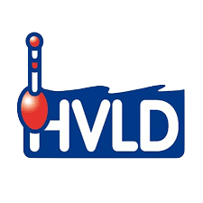

# **HVLD Visserij-Controle Applicatie**

<p align="center"></p>

## **1. Overzicht en Doelstelling**

De **HVLD Visserij-Controle Applicatie** is een moderne, webgebaseerde applicatie, specifiek ontworpen ter ondersteuning van vrijwillige sportviscontroleurs en bestuursleden van hengelsportverenigingen.  
Het hoofddoel is het bieden van een **uniform, juridisch correct en traceerbaar registratiesysteem** voor alle controle-activiteiten, van de start van een ronde tot de definitieve administratieve afhandeling van een overtreding.

### **Kernfunctionaliteiten**

* **Controle Rondes:** Realtime vastlegging van controleactiviteiten, inclusief start-/eindtijd, controller en gecontroleerd water.  
* **Overtredingsregistratie:** Gestandaardiseerde vastlegging van overtredingen met koppeling naar:  
  * Overtredingstype (Code, Omschrijving).  
  * Geadviseerde sanctie (via recidive-check).  
  * Genomen Maatregel (Sanctie).  
* **Recidive-Check:** Automatische controle van het Vispasnummer tegen eerdere overtredingen om de correcte, geëscaleerde strafmaat te adviseren.  
* **Maatregelenbeheer:** Ondersteuning van zowel interne verenigingsmaatregelen (WA, VPA) als operationele registraties (OKE, ADM) en officiële meldingen (BOA, POL).

## **2. Technische Architectuur**

Dit is een **Monolithische Single Page Application (SPA)** met een sterke nadruk op reactiviteit en een moderne ontwikkelstack.

| Component | Technologie | Rol |
| :---- | :---- | :---- |
| **Backend** | **Laravel** (PHP) | Routing, API Endpoints, Business Logica, Database Migraties/Seeders. |
| **Frontend** | **Vue.js** | Interactieve UI, State Management, Componenten. |
| **SPA Connector** | **Inertia.js** | Naadloze brug tussen Laravel (Controller) en Vue (Page), behoudt de 'state' van de app. |
| **Styling** | **Tailwind CSS** | Utility-first CSS framework voor snelle en responsieve styling. |
| **Database** | MySQL / PostgreSQL | Permanente dataopslag. |

## **3. Entiteiten en Data Structuur**

De applicatie draait om drie hoofdentiteiten:

### **A. Strafmaten (Sancties)**

De lijst van alle mogelijke maatregelen die opgelegd of geregistreerd kunnen worden.

* **Velden:** id, code, omschrijving, order_id (voor sortering).  
* **Beheer:** CRUD-functionaliteit, gesorteerd op order_id (de prioriteit/volgorde).

### **B. Overtredingstypes**

De catalogus van feitelijke overtredingen (bijv. Vissen zonder vergunning, Meerdere hengels).

* **Velden:** id, code, omschrijving, default_strafmaat_id, recidive_strafmaat_id.  
* **Koppelingen:** Elke type heeft een standaard maatregel en een geëscaleerde recidive maatregel, beide verwijzend naar de Strafmaten tabel.

### **C. Controle Rondes**

De operationele registratie van een controle-activiteit.

* **Velden:** id, user_id (Controller), water_id, start_tijd, eind_tijd, status (Actief/Afgerond).  
* **Relatie:** Een Ronde bevat meerdere Overtredingen.

## **4. Installatie en Opstarten**

Volg deze stappen om de applicatie lokaal te installeren en op te starten:

1. **Repository Cloneren:**  
```
   git clone [repository-url]  
   cd hvld-controle-app
```

2. **Dependencies Installeren:**  
```
   composer install  
   npm install
```

3. **Configuratie:**  
```
   cp .env.example .env  
   php artisan key:generate
```

   Configureer de database-instellingen in het .env bestand.  
4. **Database Initialisatie:**  
```
   php artisan migrate --seed
```

   *Dit voert de migraties uit (inclusief de cruciale order_id kolom voor strafmaten) en vult de tabellen met basisdata.*  
5. **Applicatie Starten:**  
   # Start de Vite/NPM watcher voor frontend assets  
```
   npm run dev  
```
   # Start de Laravel ontwikkelserver  
```
   php artisan serve
```

   De applicatie is nu bereikbaar via de lokale URL van php artisan serve.

## **4.1. Kern Data Definities (Seeders)**

De volgende tabellen worden initieel gevuld door de meegeleverde Seeders en zijn cruciaal voor de werking van het advies- en registratiesysteem:

### **4.1.1. strafmaten (via StrafmaatSeeder)**

Deze tabel definieert alle mogelijke maatregelen en hun prioriteit (order_id).

| ID | Code | Omschrijving | Categorie | Order |
| :---- | :---- | :---- | :---- | :---- |
| **1** | **WA** | Waarschuwing (mondeling/officieel) | Interne Maatregel | 1 |
| **2** | **HG** | Herstelgesprek verplicht met bestuur | Interne Maatregel | 2 |
| **3** | **VPA-ZT** | Zeer Tijdelijke Inname VISpas (veldactie, 1 week) | Interne Maatregel | 3 |
| **4** | **VPA-T** | Tijdelijke Inname VISpas (bijv. 3-12 maanden) | Interne Maatregel | 4 |
| **10** | **PV** | Proces-verbaal opgemaakt door BOA/Politie | Wettelijke Sanctie | 10 |
| **11** | **JUS** | Melding aan Justitie (strafbare feiten) | Wettelijke Sanctie | 11 |

*(Noot: Codes OKE, MA, MWB zijn ook opgenomen maar zijn Operationele Acties, geen daadwerkelijke straffen.)*

### **4.1.2. overtreding_types (via OvertredingTypeSeeder)**

Dit is de catalogus van overtredingen, met de direct gekoppelde adviezen voor strafmaten.

| Code | Omschrijving | Default Strafmaat (ID) | Recidive Strafmaat (ID) |
| :---- | :---- | :---- | :---- |
| **10** | Géén schriftelijke toestemming | **1 (WA)** | **10 (PV)** |
| **15** | Vissen zonder nachtvistoestemming | **1 (WA)** | **4 (VPA-T)** |
| **20** | Vissen met meer hengels dan toegestaan | **1 (WA)** | **4 (VPA-T)** |
| **35** | Weigering medewerking verlenen | **10 (PV)** | **10 (PV)** |
| **40** | In bezit/meenemen teveel/niet toegestane vis | **3 (VPA-ZT)** | **10 (PV)** |
| **50** | Vissen met levend aas | **4 (VPA-T)** | **10 (PV)** |

*(Noot: De default_strafmaat_id en recidive_strafmaat_id verwijzen direct naar de ID's uit de strafmaten tabel. Dit is de kern van de geautomatiseerde sanctie-advisering.)*

### **4.1.3. waters (via WaterSeeder)**

Deze tabel bevat de geregistreerde viswateren met hun geografische en regelgevende context.

* **Kerngegevens:** naam, type, beheersgebied, beschrijving (met specifieke regels zoals nachtvisverboden), latitude, longitude.  
* **Doel:** Bieden van een gestandaardiseerde lijst van wateren voor de start van een Controle Ronde. De GPS-coördinaten ondersteunen kaartweergave en geofencing functionaliteit in de toekomst.

## **5. Security & Operationele Richtlijnen**

* **Rolgebaseerde Toegang:** Toegang tot beheerinterfaces (Strafmaten, Overtredingstypes) moet strikt beperkt zijn tot geautoriseerde bestuursleden/admins.  
* **Recidive Data:** De Recidive-check API moet robuust zijn en alleen de noodzakelijke metadata (historie_count, geadviseerde_strafmaat_id) teruggeven. De privacy van de visser moet gewaarborgd blijven.  
* **Data Integriteit:** Door het gebruik van order_id en standaard default_strafmaat_id koppelingen, wordt de administratieve foutmarge geminimaliseerd. Dit waarborgt juridische consistentie.

## **6. Bijdragen en Code of Conduct**

Zie de afzonderlijke bestanden:

* [SECURITY.md](SECURITY.md) voor onze Responsible Disclosure Statement and Security Policy
* [CONTRIBUTING.md](CONTRIBUTING.md) voor richtlijnen bij het aanleveren van Pull Requests.  
* [CODE_OF_CONDUCT.md](CODE_OF_CONDUCT.md) voor de gedragsregels.

## **7. Licentie**

Dit project valt onder de **MIT License**. Dit is een permissieve open-source licentie die de Hengelsportvereniging Lelystad-Dronten (HVLD) in staat stelt de code vrijelijk te gebruiken, aan te passen en te onderhouden, wat cruciaal is voor de langetermijncontinuïteit van dit project. Zie het [LICENSE.md](LICENSE.md) bestand voor de volledige tekst.